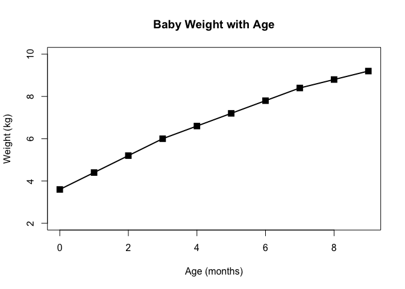
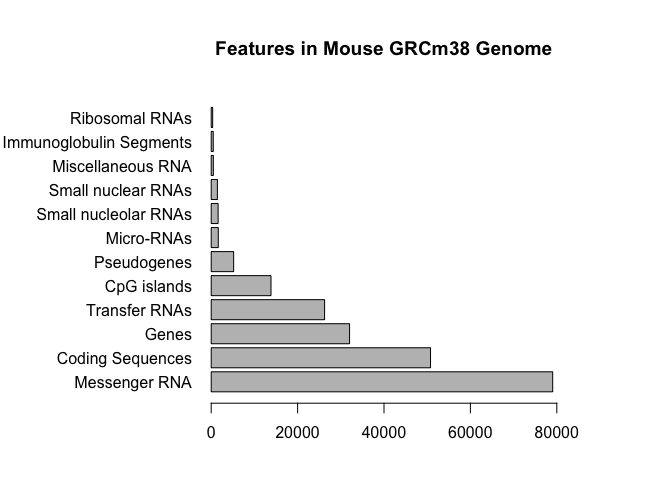
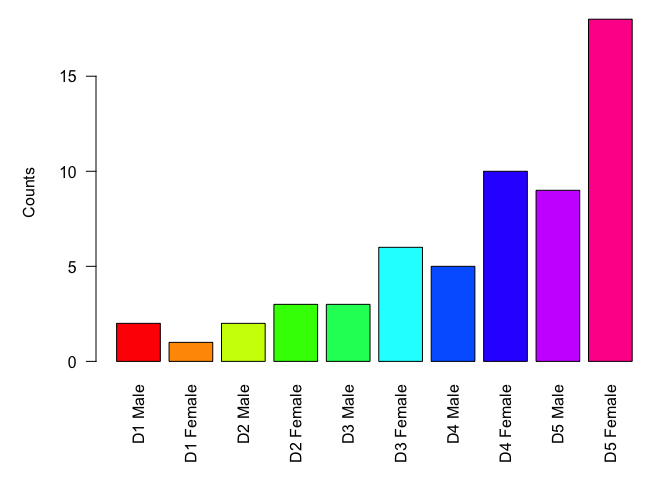

Class 5
================
Fiona Moore
5/2/2019

Graphics
--------

``` r
weight <- read.table("bimm143_05_rstats/weight_chart.txt", header = TRUE)
# par(mar=c(6, 6, 5, 6))
plot(weight$Age, weight$Weight, pch=15, cex=1.5, lwd=2, typ="o", 
     ylim=c(2,10), xlab="Age (months)", 
     ylab= "Weight (kg)", main="Baby Weight with Age")
```



``` r
# 2b. barplot
mouse <- read.table("bimm143_05_rstats/feature_counts.txt", 
           header=TRUE, sep="\t")
par(mar=c(4, 11, 5, 6))
barplot(mouse$Count, horiz=TRUE, names.arg = mouse$Feature, las=1, 
        main= "Features in Mouse GRCm38 Genome", xlim=c(0,80000), ylab="")
```



``` r
# 3A. Color vectors
counts <- read.table("bimm143_05_rstats/male_female_counts.txt", header=TRUE, sep="\t")
par(mar=c(6, 5, 1, 1))
barplot(counts$Count, names.arg= counts$Sample,
        las=2, col=rainbow(10), ylab="Counts")
```


